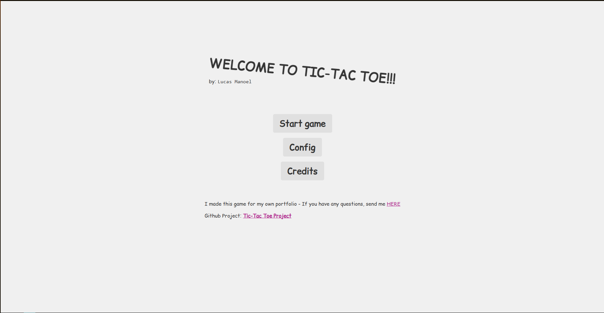
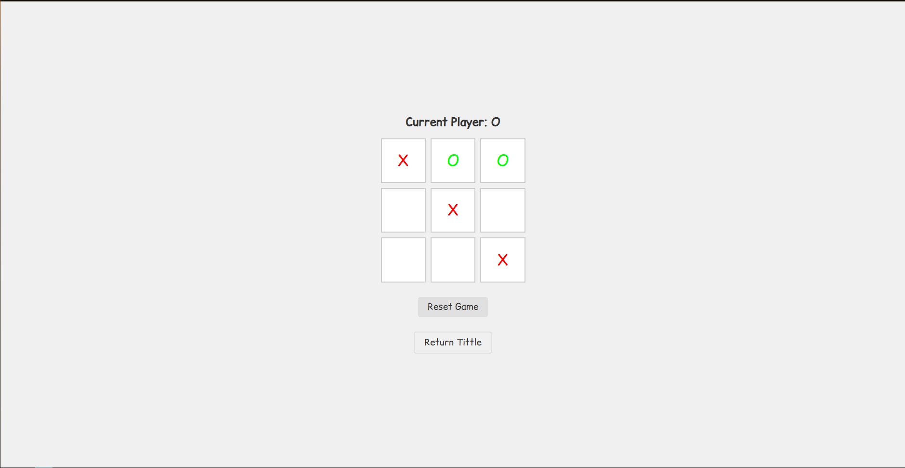
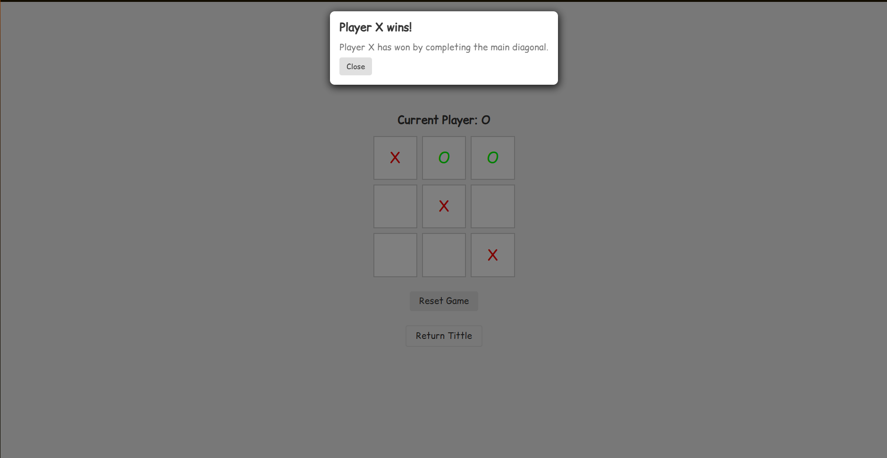

# Jogo da Velha

Um simples jogo da velha (Tic-Tac Toe) desenvolvido em JavaScript, HTML e CSS para fins de aprendizado.

## 🚀 Funcionalidades
- Jogador X vs Jogador O no mesmo dispositivo
- Indicação de vitória ou empate
- Reinício da partida

## 🛠️ Tecnologias Utilizadas
- HTML
- CSS
- JavaScript

## 🎮 Como Jogar
1. Abra o arquivo `index.html` no navegador.
2. Selecione a opção `Start Game`.
3. Clique em uma célula para marcar sua jogada.
4. O jogo alterna automaticamente entre X e O.
5. Após o término da partida, clique em "Reset Game" para jogar novamente.

## 📈 Objetivo
Praticar conceitos de:
- Manipulação de DOM
- Lógica de jogo
- Organização de código para projetos simples, porém escaláveis.

## 🎯 Estratégias Aplicadas
Este projeto foi desenvolvido aplicando princípios do livro **“Código Limpo” (Clean Code, Robert C. Martin)**, focando em:
- Nomes de variáveis e funções claros
- Funções pequenas e focadas
- Organização de responsabilidades
- Comentários apenas quando necessário

Além disso, foi utilizado **Normalize CSS** para garantir consistência de estilo entre diferentes navegadores.
Créditos: normalize.css v8.0.1 | MIT License | github.com/necolas/normalize.css 

## 🗓️ Planos Futuros
- Implementação de um sistema de personalização de jogadores.
- Alteração no nome dos jogadores.

## 📸 Capturas do jogo

## 🌐 Acesse Online
[Jogar TIC TAC TOE](https://lucasmanoel1008.github.io/tic-tac-toe/)

## 👤 Autor

Lucas Manoel - [LinkedIn](https://www.linkedin.com/in/lucas-manoel-1b06032b3) | [GitHub](https://github.com/LucasManoel1008)
